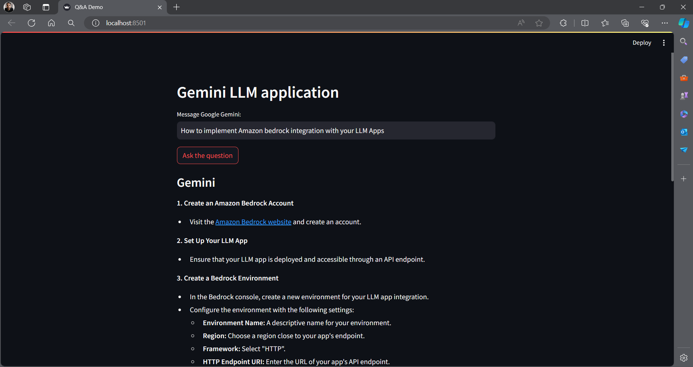

# Gemini Pro Streamlit LLM App

## Overview:
Software And Tools Requirements

1. [Github Account](https://github.com)
2. [Google Gemini Pro](https://gemini.google.com/)
3. [Visual Studio Code](https://code.visualstudio.com/)
4. [GitCLI](https://git-scm.com/book/en/v2/Getting-Started-The-Command-Line)

Technology and tools wise this project covers,

1. Python
2. Google Gemini Pro

* Framework: Streamlit 

-------------------------------------------------------------------------------------------------------------------
### Technologies Used:

           
